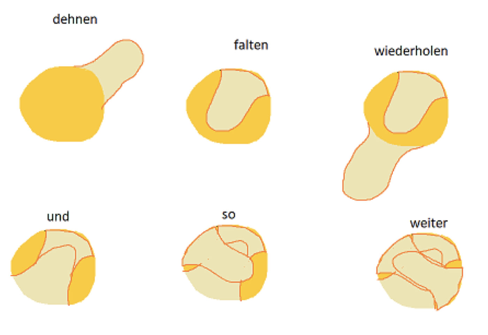
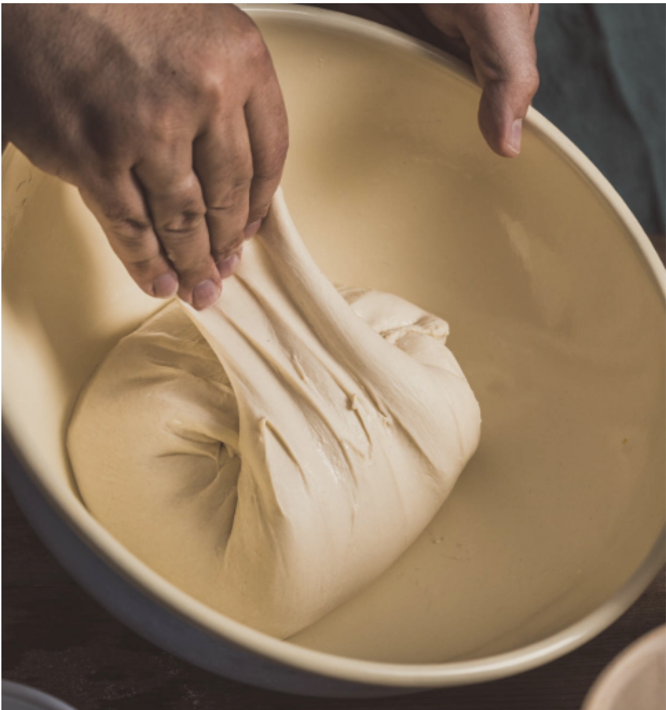

# Grundlagen

Was die verschiedenen Begriffe im Einzelnen bedeuten, wie sie interpretiert werden, was die perfekten Zeitangaben sind: darüber streitet sich die Welt. Nichtsdestotrotz bringen sie eine gewisse Struktur in den Herstellungsprozess eines Brotes.

Die folgenden Abschnitte beschreiben deshalb kein Rezept, sondern die Logik dahinter. Also was in jeder Phase mit dem Teig passiert, warum sie überhaupt existiert und woran du merkst, dass sie vorbei ist. Zeitangaben sind dabei reine Anhaltspunkte, die genauen Werte kommen aus dem Rezept.

## Begriffe

- **Autolyse**: Eine Teigruhephase, bei der Mehl und Wasser ohne Salz oder Hefe vermischt und ruhen gelassen werden, um die Glutenentwicklung und Teigstruktur zu verbessern.
- **Verzögerte Salzbeigabe**: Das Salz wird erst nach der Autolyse oder einer Teigruhe zugegeben, um die Kleberbildung und Wasseraufnahme des Mehls zu fördern, was zu einer besseren Teigentwicklung führt.
- **Fenstertest**: Durch das Aufspannen des Teiges mit den Fingern kann erkannt werden, ob sich das Glutennetzwerk gut ausgebildet hat. Hält der Teig ganz dünn seine Spannung für einen längeren Moment, dann gilt der Test als bestanden.
- **Stockgare**: Die erste Gärphase nach dem Kneten, bei der der Teig in Ruhe aufgehen kann, um sein Volumen durch Gärung zu vergrössern. Sie findet meist bei Raumtemperatur statt.
- **Kaltgare**: Eine verlängerte Gärphase bei niedriger Temperatur (meist im Kühlschrank), die das Aroma des Teigs intensiviert und die Teigstruktur stabilisiert.
- **Stückgare**: Die zweite Gärphase, nachdem der Teig portioniert und geformt wurde. Hier geht das Teigstück vor dem Backen final auf.

## Zutaten

In der Regel setzt sich ein Brotrezept aus vier Zutaten zusammen, und jede hat eine klare Aufgabe:

- **Mehl** liefert die Stärke und die Eiweisse, aus denen das Glutennetz entsteht.
- **Wasser** macht beides überhaupt erst verfügbar. Ohne Wasser bildet sich kein Gluten, arbeiten keine Enzyme und gärt nichts.
- **Treibmittel**, also Sauerteig oder Hefe, erzeugt das Gas, das den Teig auftreibt, und einen grossen Teil des Aromas.
- **Salz** würzt, bremst die Gärung und festigt das Glutennetz.

Alles Weitere wie Fett, Zucker, Ei oder Saaten kommt obendrauf und verändert vor allem, wie stark das Glutennetz belastet wird und wie lange es tragen muss.

Der Ablauf ist ebenfalls meistens derselbe. Es ist sinnvoll, sich an die folgende Reihenfolge zu gewöhnen und beim Backen auch entsprechend zu denken. Je schneller man ein Gefühl für die Routine hat, desto eher kann man an den Details rumschrauben.

## Autolyse

Mehl und Wasser werden vermengt und danach in Ruhe gelassen, ohne Salz und ohne Treibmittel. Der Teig arbeitet in dieser Phase von allein: Das Mehl saugt sich voll und das Gluten beginnt sich zu bilden, ganz ohne Kneten.

Üblich sind 30 bis 90 Minuten, abgedeckt und bei Raumtemperatur. Die Phase ist vorbei, wenn kein trockenes Mehl mehr zu sehen ist und der Teig als Ganzes zusammenhängt.

> 📌 Die Dauer der Autolyse ist gar nicht mal so wichtig. Richte sie also nach deinen Bedürfnissen. Wenn dunklere oder gar Vollkornmehle verarbeitet werden, sollte die Autolyse nie ausgelassen werden und rund 60 Minuten betragen, denn bei diesen Mehlsorten ist der Effekt am stärksten spürbar.

> 🔬 **Was dabei passiert.** Glutenin und Gliadin, die beiden Eiweisse im Mehl, verbinden sich zu Gluten, sobald sie Wasser aufnehmen. Das geschieht ganz von allein, ohne einen einzigen Knetvorgang. Gleichzeitig beginnen die mehleigenen Enzyme, Stärke in Zucker zu zerlegen, wovon später das Treibmittel lebt. Das Salz bleibt in dieser Phase draussen, weil es genau diese Enzyme bremst und dem Mehl Wasser streitig macht.

## Kneten

Beim Kneten wird aus dem groben Teig ein Netz. Das ist der Schritt, der über die spätere Krume entscheidet, alles Weitere baut nur noch darauf auf.

Der Ablauf ist immer gleich: langsam anfangen, nach etwa einer halben Minute auf die eigentliche Knetgeschwindigkeit erhöhen, Salz und Treibmittel beigeben und so lange weiterkneten, bis der Fenstertest bestanden ist. In der Regel sind das 10 bis 20 Minuten. Anschliessend ruht der Teig zugedeckt eine gute halbe Stunde bei Raumtemperatur.

> 📌 Wie lange und wie stark geknetet werden soll, ist sehr umstritten. Mit einer Küchenmaschine auf mittlerer Stufe (Stufe 3 bei der Kitchenaid) sind 10 Minuten immer ein guter Start, danach sollte der Zustand regelmässig überprüft werden, beispielsweise alle 5 Minuten. Perfektionieren lässt sich der Schritt, wenn der Teig dabei im Bereich von 24–26 Grad bleibt.
>
> Mit der Erfahrung wird man hier besser: dem Teig beim Kneten zuschauen, analysieren wie er sich entwickelt und zwischendurch die Temperatur nehmen. Nach einiger Zeit kann man mit einem Blick sagen, ob der Teig bereit ist oder ob noch etwas fehlt.

> 🚨 Gerade bei heissen Tagen (30 Grad und mehr) sollte darauf geachtet werden, dass der Teig während dem Kneten nicht heisser als 28 Grad wird, denn dann kann sich das Glutennetzwerk zurückentwickeln. Tipp: kalte Zutaten verwenden oder das Wasser teilweise als Eiswürfel beigeben. Aber nicht übertreiben: Ist der Teig kälter als 18 Grad, dauert es spürbar länger, bis das Gluten aktiviert wird.

> 🔬 **Warum Kneten stärkt.** Glutenin liefert die Elastizität, Gliadin die Dehnbarkeit. Beim Kneten werden diese Stränge ausgerichtet und über Schwefelbrücken miteinander verbunden, aus vielen kurzen Fäden wird so ein zusammenhängendes Netz. Das Salz hilft dabei: Es schirmt die elektrische Ladung der Eiweisse ab, sodass sich die Stränge nicht mehr gegenseitig abstossen und dichter packen können. Genau deshalb fühlt sich der Teig kurz nach der Salzgabe straffer an.

> 📌 Wer die Teigtemperatur treffen will, rechnet rückwärts über das Wasser: Wassertemperatur = 3 × Wunschtemperatur − Mehltemperatur − Raumtemperatur − Knetwärme. Für die Knetwärme kann man bei einer Küchenmaschine mit etwa 5 Grad rechnen, bei langem Kneten mit mehr.

## Fenstertest

Der Fenstertest ist kein eigener Arbeitsschritt, sondern die Messung dazu. Er beantwortet die einzige Frage, die beim Kneten zählt: Ist das Netz fertig oder nicht? Deshalb steht in Rezepten auch meistens eine Zeitangabe und der Test, und im Zweifel gilt der Test.

Dazu kann man den Knetvorgang jederzeit stoppen und etwas Teig in die Hände nehmen, um ihn aufzuspannen. Durch das regelmässige Aufspannen entwickelt man ein gutes Gefühl für die Qualität des Glutennetzwerkes.

> 🔬 Der Film, den du zwischen den Fingern aufspannst, ist genau das, was später das Gas halten muss. Reisst er hier, reisst er im Ofen auch um jede einzelne Gasblase.

## Dehnen & Falten

Dehnen und Falten ist Kneten in Zeitlupe. Der Teig wird nicht mehr bearbeitet, sondern nur noch in Runden gedehnt, dazwischen darf er gären. So wird das Netz weiter gestärkt, ohne dass die entstandenen Gasblasen zerdrückt werden.

Dazu den Teig von allen Seiten anheben und zur Mitte hin falten, danach wieder abdecken und rund 30 Minuten bei Raumtemperatur ruhen lassen. Diesen Schritt ein- bis zweimal wiederholen.

> 📌 Wichtig für die Vernetzung des beim Kneten entwickelten Glutennetzwerkes. Durch die Überlappung der Glutennetze kann später mehr Gas im Brot gebunden werden.
>
> Verzichte auf weitere Dehn- und Faltrunden, wenn sich der Teig bereits wie eine Wolke anfühlt und sichtlich aufgegangen ist.

## Stockgare

In der Stockgare passiert zum ersten Mal nichts mehr von aussen. Der Teig gärt als Ganzes, das Treibmittel füllt die vorhandenen Gasblasen und das Aroma entsteht.

Weil unzählige Faktoren die Dauer beeinflussen, ist die Uhr hier der schlechteste Ratgeber. Gemessen wird am Volumen: Bei anschliessender Kaltgare reicht knapp das 1,5-Fache, sonst wartet man die Verdoppelung ab. Wer sich am Volumen orientiert statt an der Zeit, bekommt deutlich konstantere Ergebnisse.

> 📌 Lagere den Teig am besten in einem Gefäss, in dem sich die Volumenänderung einfach ablesen lässt, zum Beispiel einem rechteckigen Tupperware.

> 🔬 **Es entstehen keine neuen Blasen.** Wie viele Gasbläschen im Teig sind, wird beim Kneten entschieden, die Gärung bläst nur auf, was schon da ist. Das Kohlendioxid löst sich zuerst im Teigwasser und wandert von dort in die bestehenden Bläschen. Deshalb entscheiden Kneten und behutsames Formen über die Krume, nicht die Gärdauer.

## Kaltgare

Die Kaltgare ist eine Verlängerung der Stockgare in der Kälte und damit optional. Man nimmt sie, wenn man mehr Aroma will oder wenn der Zeitplan es verlangt, denn sie macht aus einem Tagesprojekt zwei entspannte Etappen.

Üblich sind mehrere Stunden bis über Nacht im Kühlschrank, mit dem Ziel, dort das nahezu doppelte Volumen zu erreichen. Durch die tiefen Temperaturen geht das langsamer, wodurch sich mehr Aromen bilden können.

> 📌 Man kann den Teig je nach Bedarf auch vor der Kaltgare bereits formen, damit er sich danach kurz an die Raumtemperatur akklimatisieren kann, bevor er direkt in den Ofen wandert.

> 🔬 **Warum kalt mehr Aroma gibt.** Die Kälte bremst das Treibmittel stärker als die Milchsäurebakterien und die Enzyme des Mehls. Pro Volumen Gas entstehen also mehr Säure und mehr Aromastoffe. Der Teig gärt nicht einfach langsamer, er gärt anders. Dazu kommt ein praktischer Nebeneffekt: Kalter Teig ist fester und lässt sich viel sauberer einschneiden.

## Formen

Beim Formen bekommt der Teig seine Gestalt und, viel wichtiger, seine Spannung. Eine straffe Oberfläche hält das Gas zusammen und zwingt den Teig im Ofen nach oben statt in die Breite.

Dazu den Teig auf eine Arbeitsfläche stürzen, wobei die Seite, welche im Behälter oben war, nun unten liegen soll. Anschliessend portionieren und vorsichtig in Form bringen. Darauf achten, dass nicht zu viel Luft entweicht.

> 📌 Beim Formen geht unweigerlich Luft verloren, und das ist auch in Ordnung. Je behutsamer und verlustärmer man vorgehen kann, desto besser.
>
> Es gibt verschiedene Techniken und es kommt auch etwas auf die Art des Brotes drauf an. Beim [Baguette](/baguette) wird zum Beispiel gerne zweimal geformt, damit so viel Spannung wie möglich in den Teig kommt.

## Stückgare

Die Stückgare ist die letzte Gärphase. Der Teigling erholt sich vom Formen und füllt sich ein letztes Mal mit Gas, bevor er in den Ofen kommt. Sie dauert typischerweise eine halbe bis anderthalb Stunden bei Raumtemperatur.

Hier braucht es viel Erfahrung, um spüren zu können, ob der Teig bereit für den Ofen ist. Drückt man mit dem Finger leicht in den Teig:

- Die Delle springt **direkt zurück**: Er muss noch etwas.
- Die Delle kommt **gleichmässig und ruhig innert ein paar Sekunden** zurück: schon besser.
- Zusätzlich fühlt sich der Teig **durchgehend weich** an, nicht nur an der Oberfläche: Er ist bereit.
- Die Delle springt **fast gar nicht mehr zurück** und es bilden sich Risse: vermutlich Übergare.

> 🔬 Was du dabei fühlst, ist die Rückstellkraft des Glutennetzes. Zu Beginn ist es kaum gedehnt und schnellt sofort zurück. Je voller die Gasblasen werden, desto stärker steht es unter Spannung, bis es an seiner Grenze nachgibt und reisst. Das ist die Übergare.

## Backen

Temperatur und Backzeit gibt das Rezept vor, der Rest ist unabhängig davon immer dasselbe: Der Ofen muss richtig vorgeheizt sein, die Hitze soll von unten kommen und am Anfang braucht es Dampf.

Am besten gelingt das in einem Gusseisentopf, der den eigenen Dampf einschliesst, oder auf einem umgedrehten Backblech. Beim Letzteren kann mit einer Flasche beim Einschieben des Teiges noch etwas Wasser in den Ofen gespritzt werden, um Dampf zu erzeugen.

> 🔬 **Was im Ofen passiert.** Der Ofentrieb kommt nicht nur vom Kohlendioxid: Ab 78 Grad verdampft der bei der Gärung entstandene Alkohol, dazu dehnt sich das Wasser als Dampf aus. Bei 55–60 Grad stirbt das Treibmittel, zwischen 55 und 70 Grad verkleistert die Stärke und die Krume «steht», ab rund 140 Grad läuft die Maillard-Reaktion, die für Kruste, Farbe und Röstaroma sorgt.
>
> Der Dampf im Ofen hält die Oberfläche so lange geschmeidig, wie das Brot noch aufgeht. Ohne ihn verkrustet sie zu früh und das Brot kann an den Schnitten nicht mehr aufreissen.

> 📌 Nach dem Backen sollte das Brot 2–5 Stunden komplett auskühlen, damit das beste Ergebnis erzielt wird. Aber let’s be honest, es schmeckt ofenfrisch am besten.

> 🔬 Beim Auskühlen kristallisiert die Stärke nach, und erst dadurch wird die Krume schnittfest. Wer zu früh anschneidet, bekommt eine klitschige Krume. Nicht weil das Brot nicht durchgebacken wäre, sondern weil es noch nicht fertig ist.
