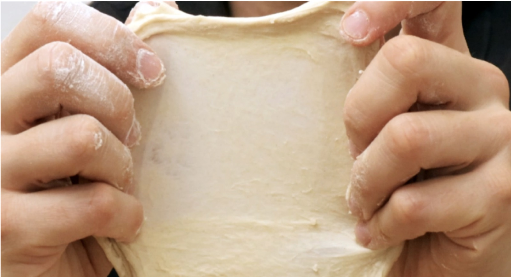

## Wo die Dateien liegen

```
src/inhalt/wissen/    Grundlagenseiten, erscheinen automatisch in der Navigation
src/inhalt/rezepte/   Rezepte, erscheinen automatisch auf der Startseite
src/inhalt/bilder/    Fotos und Grafiken
vorlagen/             Kopiervorlagen für neue Seiten
```

Ein neues Rezept entsteht, indem man `vorlagen/rezept.md` nach
`src/inhalt/rezepte/` kopiert und umbenennt. Der Dateiname wird zur Adresse:
`roggenbrot.md` wird zu `/rezepte/roggenbrot`. Verlinkt und einsortiert wird
automatisch, es muss nirgends eine Liste nachgeführt werden.

Wer eine Komponente mitten im Text braucht, benennt die Datei von `.md` auf
`.mdx` um — sonst ändert sich nichts.

## Frontmatter

Der Block zwischen den `---` am Dateianfang trägt alles Strukturierte: Titel,
Kennzahlen, Zutaten, Diagramme. Die Prosa steht darunter. Vertippt man sich bei
einem Feldnamen, bricht der Build mit einer klaren Meldung ab, statt die Seite
still falsch zu bauen.

### Bei jeder Seite

```yaml
titel: Baguette              # Pflicht
lead: Mit Sauerteig und …    # Pflicht, der Einleitungssatz
kicker: Rezept               # Kleine Zeile über dem Titel
reihenfolge: 10              # Kleinere Zahl steht weiter vorne
verzeichnis: true            # Inhaltsverzeichnis aus den ##-Überschriften
bild: ../bilder/baguette.jpg # Bild für die Kachel auf der Startseite
bildAlt: Ein angeschnittenes Baguette.
kartentext: Kurztext für die Kachel, sonst wird der Lead genommen.
kartenmeta:
  - 77 % Hydration
  - ca. 17 h
```

### Nur bei Rezepten

Kennzahlen werden zur Leiste unter dem Titel:

```yaml
kennzahlen:
  - { label: "Hydration", wert: "77",    einheit: "%" }
  - { label: "Backzeit",  wert: "30–40", einheit: "Min." }
```

Zutaten in Gruppen; zwischen den Gruppen entsteht Luft, `trenner` setzt ein
«oder» mitten hinein:

```yaml
zutaten:
  - posten:
      - { name: "Weizenmehl Typ 550", menge: "500 g" }
      - { trenner: "oder" }
      - { name: "Ruchmehl", menge: "500 g" }
  - posten:
      - { name: "Wasser", menge: "350 g" }
      - { name: "Frischhefe", hinweis: "alternativ 1 g Trockenhefe", menge: "2,5 g" }
```

:::achtung[Anführungszeichen nicht vergessen]
Werte mit Komma müssen in `"…"` stehen. Ohne Anführungszeichen liest YAML
`2,5 g` als zwei Einträge und der Build bricht ab.
:::

Die beiden Diagramme entstehen ebenfalls aus dem Frontmatter — es braucht weder
HTML noch eine Bibliothek. Die Farben der Zeitplan-Phasen ergeben sich aus ihrer
Reihenfolge, früh hell bis spät dunkel:

```yaml
baeckerprozente:
  unterzeile: Alle Zutaten im Verhältnis zum Mehl (500 g = 100 %)
  legende: Was man aus dem Diagramm lesen soll.
  max: 100
  werte:
    - { name: "Mehl",   wert: 100 }
    - { name: "Wasser", wert: 78 }
    - { name: "Salz",   wert: 2.4 }

zeitplan:
  titel: Vom Anrühren bis aus dem Ofen
  unterzeile: Rund 16 Stunden, davon 45 Minuten aktive Arbeit
  phasen:
    - { name: "Autolyse", minuten: 60 }
    - { name: "Kaltgare", minuten: 600, anzeige: "8–16 Std." }
    - { name: "Backen",   minuten: 35 }
```

## Panels

Vier Sorten: `info`, `tipp`, `achtung` und `zutaten`. Der Titel in eckigen
Klammern ist optional.

```markdown
:::info[Bassinage]
Das später beigegebene Wasser wird vom Mehl nicht mehr gleich gut aufgenommen.
:::
```

:::info[Bassinage]
Das später beigegebene Wasser wird vom Mehl nicht mehr gleich gut aufgenommen.
:::

Ohne Titel, und mit eigenem Icon über `{icon="…"}`:

```markdown
:::tipp
Lagere den Teig in einem Gefäss, an dem sich die Volumenänderung ablesen lässt.
:::

:::info{icon="💦"}
Der Wassergehalt wird im Verhältnis zum frischen Mehl angegeben.
:::
```

:::tipp
Lagere den Teig in einem Gefäss, an dem sich die Volumenänderung ablesen lässt.
:::

:::info{icon="💦"}
Der Wassergehalt wird im Verhältnis zum frischen Mehl angegeben.
:::

:::achtung[Achtung]
Wird der Teig beim Kneten wärmer als 28 Grad, kann sich das Glutennetzwerk
zurückentwickeln.
:::

## Listen

Normale Aufzählungen brauchen nichts Besonderes — ein `-` genügt. Für
Arbeitsschritte mit Kreis-Ziffern und für Checklisten gibt es je eine Direktive:

```markdown
:::schritte
1. ### Autolyse

   Mehl und Wasser vermengen und 60 Minuten ruhen lassen.

2. ### Kneten

   Sauerteig und Salz beigeben, 10 Minuten kneten.
:::
```

:::schritte
1. ### Autolyse

   Mehl und Wasser vermengen und 60 Minuten ruhen lassen.

2. ### Kneten

   Sauerteig und Salz beigeben, 10 Minuten kneten.
:::

```markdown
:::checkliste
- Sauerteig verdoppelt sich innert 2,5 Stunden.
- Zweimal aufgefrischt innert 24 Stunden.
:::
```

:::checkliste
- Sauerteig verdoppelt sich innert 2,5 Stunden.
- Zweimal aufgefrischt innert 24 Stunden.
:::

:::tipp[Direktive in Direktive]
Steckt ein Panel in einem Arbeitsschritt, braucht der äussere Block **mehr
Doppelpunkte** als der innere — also `::::schritte` aussen und `:::tipp` innen.
Sonst endet der äussere Block schon beim ersten `:::`.
:::

## Begriffslisten

Begriff auf eine eigene Zeile, Erklärung darunter mit `:` und drei Leerzeichen.
Folgezeilen werden eingerückt.

```markdown
Stockgare
:   Die erste Gärphase nach dem Kneten, meist bei Raumtemperatur.

Stückgare
:   Die zweite Gärphase, nachdem der Teig geformt wurde.
```

Stockgare
:   Die erste Gärphase nach dem Kneten, meist bei Raumtemperatur.

Stückgare
:   Die zweite Gärphase, nachdem der Teig geformt wurde.

## Bilder

Ein Bild, das allein in einer Zeile steht, wird automatisch zur Abbildung. Der
Text in Anführungszeichen wird zur Bildlegende, der Text in eckigen Klammern
zum Alternativtext für Screenreader — der ist keine Kür, sondern gehört dazu.

```markdown

```



Um die Grösse muss man sich nicht kümmern: Beim Bauen werden die Bilder auf
WebP umgerechnet und verkleinert. Originale gehören unverändert nach
`src/inhalt/bilder/`.

## Tabellen

Ganz normale Markdown-Tabellen. Auf schmalen Bildschirmen werden sie
automatisch seitlich rollbar, ohne dass die Seite verrutscht.

```markdown
|                | 50 % Wasser | 100 % Wasser |
| -------------- | ----------- | ------------ |
| **Hefeanteil** | Hoch        | Tief         |
| **Pflege**     | Aufwendig   | Einfach      |
```

|                | 50 % Wasser | 100 % Wasser |
| -------------- | ----------- | ------------ |
| **Hefeanteil** | Hoch        | Tief         |
| **Pflege**     | Aufwendig   | Einfach      |

## Zitate

```markdown
> Der Teig ist bereit, sobald er sich innert 2,5 Stunden verdoppelt.
```

> Der Teig ist bereit, sobald er sich innert 2,5 Stunden verdoppelt.

## Links

Interne Links beginnen mit `/`, ohne `/panetrisi` davor — das Präfix wird beim
Bauen gesetzt. So bleiben die Links auch dann richtig, wenn die Seite einmal
unter einer eigenen Domain läuft.

```markdown
Kneten, bis der [Fenstertest](/wissen/grundlagen#fenstertest) bestanden ist.
```

Kneten, bis der [Fenstertest](/wissen/grundlagen#fenstertest) bestanden ist.

Die Sprungmarke hinter dem `#` ist die Überschrift in Kleinbuchstaben, Leer- und
Sonderzeichen werden zu Bindestrichen. Aus `## Dehnen & Falten` wird
`#dehnen--falten`.
